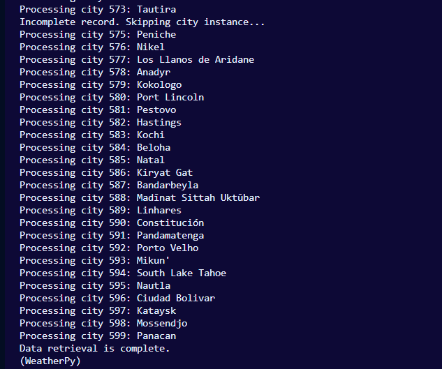
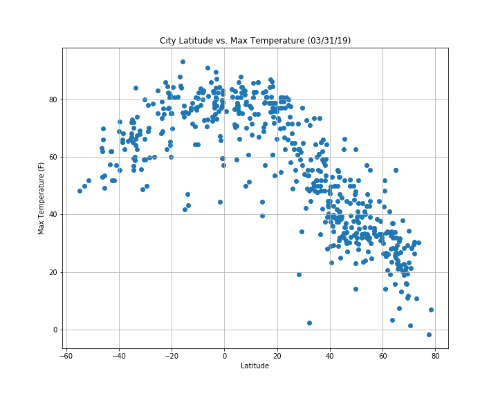
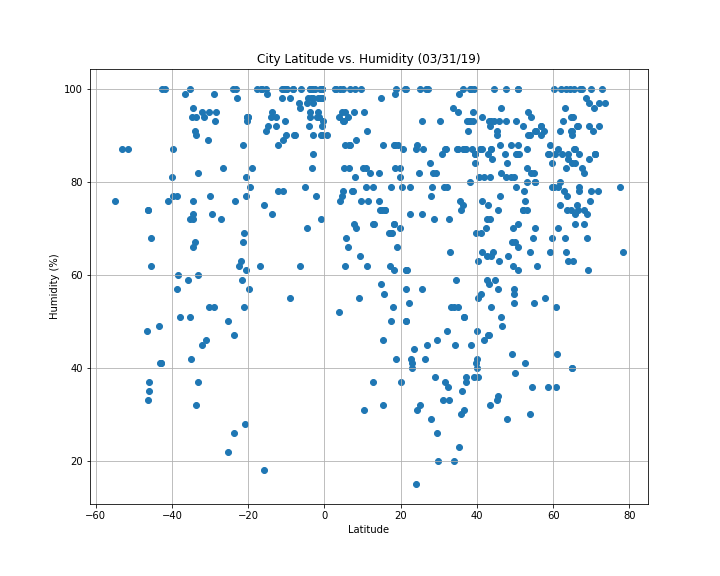
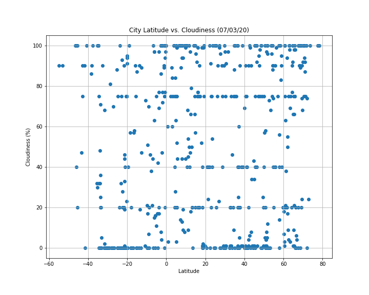

## WeatherPy

A Python script to visualize data points of the weather for 500+ cities across the world of varying distance from the equator. 
For this project, I utilized Python requests, the OpenWeatherMap API, and JSON traversals to create a series of scatter plots to showcase the following relationships:

* Temperature (F) vs. Latitude
* Humidity (%) vs. Latitude
* Cloudiness (%) vs. Latitude
* Wind Speed (mph) vs. Latitude

## The script "WeatherPy"
* Randomly selects **at least** 500 unique (non-repeat) cities based on latitude and longitude.
* Performs a weather check on each of the cities using a series of successive API calls.
* Prints a log of each city as it's being processed with the city number and city name.
* Saves both a CSV of all data retrieved and png images for each scatter plot.

*This project was for an assignment as Washington University's Data Analytics Boot Camp (2019).*

# Results

## Processing Cities

## Temperature (F) vs. Latitude

## Humidity (%) vs. Latitude

## Cloudiness (%) vs. Latitude

## Wind Speed (mph) vs. Latitude

